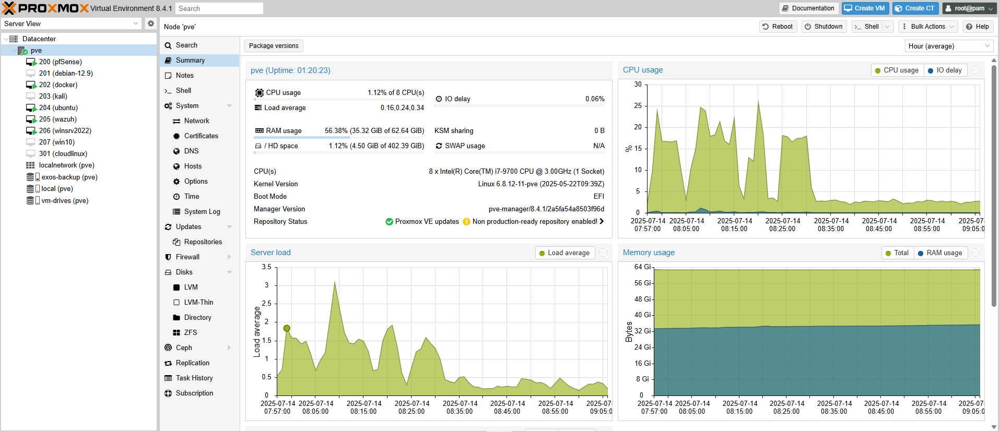

## Projekt Home-Lab

Projekt zakłada budowę kompleksowego, domowego laboratorium opartego na platformie wirtualizacyjnej Proxmox VE do nauki,
 testowania i praktycznego zdobywania doświadczenia z różnymi rozwiązaniami i narzędziami.
 
Kluczowe elementy i narzędzia zbudowane w ramach projektu obejmują:

Infrastruktura sieciowa i zarządzanie:
- pfSense Firewall: Pełni rolę głównego firewalla, zapewniając segmentację sieci za pomocą wielu sieci VLAN.
 
Narzędzia bezpieczeństwa:
- Kali Linux: Maszyna atakująca i narzędzie do zarządzania labem.
- Wazuh: System SIEM (Security Information and Event Management) i XDR (Extended Detection and Response) do zbierania, analizowania i monitorowania logów z Kali Linux, serwera Docker, kontenerów, firewalla pfSense oraz kontrolera domeny Windows. Umożliwia również skanowanie luk w zabezpieczeniach i monitorowanie integralności plików.
   
Środowiska i maszyny wirtualne:
- Serwery Docker (Ubuntu Server z Dockerem i Portainerem): Używane do wdrażania i zarządzania kontenerami, w tym różnymi aplikacjami podatnymi na ataki.
- Środowisko Windows Active Directory:
       *  Windows Server 2022: Skonfigurowany jako kontroler domeny (Domain Controller) z usługami Active Directory, DHCP i DNS.
       *  Windows 10/11: Stacje robocze podłączone do domeny, służące do testowania polityk grupowych i interakcji w środowisku domenowym.

Projekt stanowi praktyczne studium przypadku budowy i zarządzania złożoną infrastrukturą bezpieczeństwa, przedstawiającym wszechstronne doświadczenie w obszarze administracji systemami IT.

---

Szczegółowy opis projektu (dokumentacja) znajduje się w pliku [Dokumentacja home-lab.pdf](Dokumentacja%20home-lab.pdf) 
